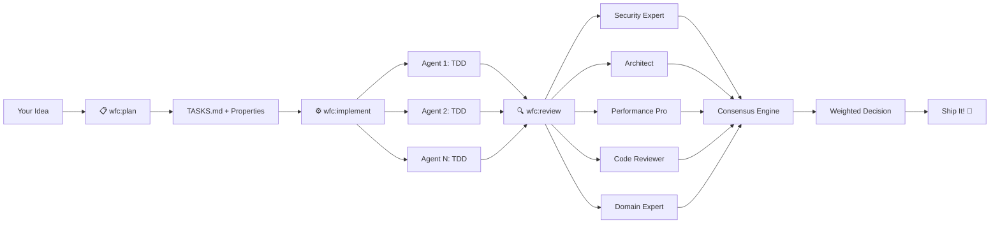

<div align="center">


# 🚀 The Multi-Agent Framework That Doesn't Fuck Around

[](https://opensource.org/licenses/MIT)
[](https://www.python.org/downloads/)
[](https://claude.ai/code)
[](docs/CONTRIBUTING.md)

**Stop shipping bugs. Start shipping excellence.**

WFC isn't just another code review tool—it's a **panel of 54 expert AI personas** that tear through your code like a senior engineering review board, but in **parallel**, without **ego**, and with **zero** coffee breaks.

[Quick Start](#-quick-start) • [Features](#-the-wfc-difference) • [Docs](docs/) • [Examples](docs/examples/) • [Contributing](docs/CONTRIBUTING.md)

</div>

---

## 💥 The Problem

Traditional development: one developer, one perspective, one chance to miss that **critical security flaw**, that **performance bottleneck**, that **architectural landmine**.

Solo coding means solo risk.

**What if you had an entire engineering team—from planning through review?**

## ✨ The WFC Solution

WFC gives you a **complete engineering team** for your entire workflow:<br>

**📋 Planning** - Structured task breakdown with dependencies and properties<br>
**⚙️ Implementation** - Parallel TDD agents in isolated worktrees<br>
**🔍 Review** - 54 expert personas, 5 per review, true consensus<br>

**Not just review. The whole workflow. In parallel. World-class.**<br>

Your specialists:
- 🛡️ Security experts who've seen every attack vector
- 🏗️ Architects who spot design flaws instantly
- ⚡ Performance engineers who catch N+1s before production
- 🔬 Quality specialists who demand excellence

## 🎯 The WFC Difference

<table>
<tr>
<td width="50%">

### 😴 Traditional Development
- Single developer, single perspective
- Sequential: plan → code → review
- Anchoring bias in team reviews
- Miss edge cases & security holes
- Reviewer fatigue & blind spots
- One reviewer per PR

</td>
<td width="50%">

### 🔥 WFC Team Workflow
- **Complete workflow**: plan → implement → review
- **Parallel TDD agents** in isolated worktrees
- **54 expert personas**, 5 per review
- **Zero bias**—independent consensus
- **Multi-domain** coverage guaranteed
- **Never tired**, always thorough

</td>
</tr>
</table>

### ⚡ How It Works



**Intelligence baked in:**
- 🧠 **Smart Persona Selection**: Matches your tech stack, complexity, and risk profile
- 🎯 **Relevance Weighting**: Security experts weigh more on auth code
- 🔬 **Consensus Detection**: Flags issues 3+ experts agree on
- 💎 **Unique Insights**: Surfaces criticals only ONE expert caught

## 🚀 60 Second Setup

**Get elite code review in less time than it takes to make coffee:**

```bash
git clone https://github.com/sam-fakhreddine/wfc.git
cd wfc
pip install -e ".[all]"
```

**That's it.** WFC is now installed and ready to tear through your codebase.

The installer automatically:
- ✅ Installs WFC to `~/.claude/skills/wfc`
- ✅ Loads 54 expert personas
- ✅ Configures intelligent selection algorithm
- ✅ Integrates with Claude Code

---

## 🎬 Your First Review

**In Claude Code:**

```bash
/wfc:consensus-review TASK-001
```

**Watch WFC work:**

```
🔍 Analyzing codebase...
   └─ Tech Stack: Python, FastAPI, PostgreSQL, Redis
   └─ Complexity: L (Large)
   └─ Properties: SECURITY, PERFORMANCE

🎯 Selecting expert panel...
   ✓ APPSEC_SPECIALIST (0.95 relevance) - OAuth/JWT expert
   ✓ BACKEND_PYTHON_SENIOR (0.88) - FastAPI patterns
   ✓ API_SECURITY_SPECIALIST (0.82) - Token security
   ✓ DB_ARCHITECT_SQL (0.72) - Token storage
   ✓ SRE_SPECIALIST (0.61) - Key rotation, monitoring

🔬 Running parallel reviews...
   ████████████████████ 100% (5/5 experts)

📊 Synthesizing consensus...
   Overall Score: 8.0/10 (weighted)

✅ APPROVED with recommendations
```

**Want specific experts?** Override the AI:

```bash
/wfc:consensus-review TASK-001 --personas BACKEND_PYTHON_SENIOR,APPSEC_SPECIALIST,DB_ARCHITECT_SQL
```

---

---

## 🎭 Meet Your 54-Expert Review Board

<div align="center">

**The most specialized AI code review team ever assembled**

| Panel | Experts | Specialty |
|-------|---------|-----------|
| 👨‍💻 **Engineering** | 11 | Python • Node • Java • Go • Rust • React • Vue • Angular • iOS • Android |
| 🛡️ **Security** | 8 | AppSec • PenTest • Compliance • Cloud Security • API Security • Crypto |
| 🏗️ **Architecture** | 7 | Solutions • APIs • Microservices • DDD • Event-Driven • Cloud • Integration |
| ✅ **Quality** | 8 | Performance • Load Testing • Code Review • Test Automation • Chaos • A11y |
| 📊 **Data** | 4 | SQL • NoSQL • Data Engineering • ML Engineering |
| 🎨 **Product** | 3 | Developer Experience • Technical PM • UX Research |
| ⚙️ **Operations** | 4 | SRE • Platform • DevOps • Observability |
| 🏦 **Domain** | 5 | Fintech • Healthcare (HIPAA) • E-commerce • Gaming • IoT |
| 🔧 **Specialists** | 4 | WCAG • Performance Optimization • i18n • Tech Debt |

**Total: 54 experts ready to review your code**

</div>

### 🎯 Smart Persona Selection

WFC analyzes your code and automatically picks the right experts:
- **Tech stack match** - Python code? Python experts review it
- **Properties** - Security-critical? Security specialists weigh in
- **Complexity** - Large refactor? Senior engineers join the panel
- **Domain knowledge** - Payments code? Fintech expert included

**Example:** OAuth2 implementation automatically gets AppSec, API Security, Backend Python, Database, and SRE experts.

## 🔬 True Independence, Zero Bias

**Each expert reviews in complete isolation** - no context sharing, no groupthink.

Traditional multi-agent systems let agents see each other's reviews, creating anchoring bias. WFC runs experts in separate subprocesses. They form independent opinions, then we synthesize.

**Why this matters:**
- 🎯 No anchoring bias - genuine independent opinions
- 💎 Unique insights surface - if only 1 expert caught it, you see it
- ⚖️ Disagreements preserved - not averaged into meaningless consensus

## 📈 Consensus Synthesis

After independent reviews, WFC synthesizes findings with relevance weighting:
- **Consensus areas** - Issues 3+ experts agree on
- **Unique insights** - Criticals only ONE expert caught
- **Divergent views** - Where experts disagree (investigate!)
- **Weighted scoring** - Security experts weigh more on auth code

### 🎯 Real Review Output

```diff
╔════════════════════════════════════════════════════════════════╗
║  WFC CONSENSUS REVIEW - TASK-001 (OAuth2 Implementation)      ║
╚════════════════════════════════════════════════════════════════╝

📊 OVERALL SCORE: 8.0/10 (relevance-weighted)

┌─────────────────────────────────────────────────────────────┐
│ ✅ CONSENSUS AREAS (4/5 experts agree)                      │
├─────────────────────────────────────────────────────────────┤
│ • Auth flow implementation is solid                         │
│ • Clean FastAPI patterns throughout                         │
│ • Good separation of concerns                               │
│ • Adequate error handling                                   │
└─────────────────────────────────────────────────────────────┘

┌─────────────────────────────────────────────────────────────┐
│ 🚨 CRITICAL ISSUES (Must Fix)                               │
├─────────────────────────────────────────────────────────────┤
│ 1. PII in JWT payload (APPSEC + API_SECURITY)              │
│    └─ Severity: CRITICAL                                    │
│    └─ Impact: GDPR violation, security risk                 │
│    └─ Fix: Remove username from token claims                │
│                                                             │
│ 2. Missing token refresh rotation (APPSEC only)            │
│    └─ Severity: HIGH                                        │
│    └─ Impact: Compromised tokens never expire               │
│    └─ Fix: Implement refresh token rotation pattern         │
└─────────────────────────────────────────────────────────────┘

┌─────────────────────────────────────────────────────────────┐
│ 💎 UNIQUE INSIGHTS (Only 1 expert caught these)             │
├─────────────────────────────────────────────────────────────┤
│ • Token table missing index on user_id (DB_ARCHITECT)      │
│   └─ Fix: ALTER TABLE tokens ADD INDEX idx_user_id         │
│                                                             │
│ • No metrics for token failures (SRE_SPECIALIST)           │
│   └─ Fix: Add token_validation_failures counter            │
└─────────────────────────────────────────────────────────────┘

┌─────────────────────────────────────────────────────────────┐
│ ⚖️ DIVERGENT VIEWS (Experts disagree - investigate!)       │
├─────────────────────────────────────────────────────────────┤
│ • Token expiration time:                                    │
│   └─ APPSEC: 15 minutes (more secure)                      │
│   └─ BACKEND: 1 hour (better UX)                           │
│   └─ Recommendation: 30 minutes + refresh pattern          │
└─────────────────────────────────────────────────────────────┘

╔════════════════════════════════════════════════════════════════╗
║  DECISION: ⚠️ CONDITIONAL APPROVE                             ║
╠════════════════════════════════════════════════════════════════╣
║  Required Changes:                                             ║
║  1. Remove PII from JWT payload                                ║
║  2. Implement refresh token rotation                           ║
║  3. Add database index on user_id                              ║
║  4. Add token failure metrics                                  ║
║                                                                ║
║  ⏱️ Re-review after changes                                    ║
╚════════════════════════════════════════════════════════════════╝
```

**The result?** Nothing slips through the cracks.

## 🔧 Extend & Customize

**Need a specialist we don't have?** Add custom personas to `~/.claude/skills/wfc/personas/custom/`. See [Contributing Guide](docs/CONTRIBUTING.md) for details.

---

## 💡 Why WFC?

<table>
<tr>
<td width="50%">

### 😩 Without WFC
- "Ship it, looks good to me"
- Critical bug in production
- "Why didn't anyone catch this?"
- Security breach, downtime, panic
- Post-mortem: "We need better reviews"

**The cycle repeats...**

</td>
<td width="50%">

### 😎 With WFC
- 54 experts review every line
- Security, performance, architecture analyzed
- Bugs caught before commit
- Production stays stable
- Team ships with confidence

**The cycle stops.**

</td>
</tr>
</table>

**Time savings:** 5 experts review in parallel = **same time as 1 review**

**Quality gains:** 54 specialized perspectives = **issues you'd never catch alone**

**Cost:** Free, open source, runs locally

---

## 📚 Documentation

<table>
<tr>
<td>

**📖 Guides**
- [Architecture](docs/ARCHITECTURE.md)
- [Implementation Guide](docs/WFC_IMPLEMENTATION.md)
- [Contributing](docs/CONTRIBUTING.md)

</td>
<td>

**📋 Reference**
- [Complete Persona Library](docs/PERSONAS.md)
- [Configuration Options](wfc/shared/config/wfc_config.py)
- [Examples & Use Cases](docs/examples/)

</td>
</tr>
</table>

**Configuration:** See `~/.claude/skills/wfc/shared/config/wfc_config.py` for options (panel size, diversity enforcement, scoring thresholds).

---

## 🧪 Testing & Health

```bash
# Run WFC test suite
pytest -v

# System health check
make doctor

# Integration tests
make test-integration
```

---

## 🎁 The Complete Suite

WFC isn't just review—it's a **complete engineering workflow**:

| Skill | Status | What It Does |
|-------|--------|--------------|
| 🏗️ **wfc:implement** | ✅ Production | Multi-agent parallel implementation with TDD |
| 👀 **wfc:review** | ✅ Production | 54-expert consensus code review |
| 📋 **wfc:plan** | ✅ Production | Intelligent task breakdown & planning |
| 🧪 **wfc:test** | ✅ Production | Property-based test generation |
| 🛡️ **wfc:security** | ✅ Production | STRIDE threat modeling & security analysis |
| 🏛️ **wfc:architecture** | ✅ Production | C4 diagrams & architecture documentation |
| 📊 **wfc:observe** | ✅ Production | Observability from formal properties |
| 🔄 **wfc:retro** | ✅ Production | AI-powered retrospective analysis |
| 🔒 **wfc:safeclaude** | ✅ Production | Safe command allowlist generation |
| 🤔 **wfc:isthissmart** | ✅ Production | Critical thinking advisor |
| ⚡ **wfc:newskill** | ✅ Production | Meta-skill for creating new skills |

**All skills are Agent Skills compliant and production-ready.**

---

## 📜 License

MIT License - see [LICENSE](LICENSE) for details.

---

## 🙏 Acknowledgments

Built on [Claude Code](https://claude.ai/code)'s agent framework. Inspired by ensemble methods in machine learning and the wisdom of diverse expert panels.

Special thanks to [SuperClaude](https://github.com/chadbrewbaker/SuperClaude) for pioneering multi-agent patterns and demonstrating the power of specialized personas working in concert. Their confidence-first approach and agent orchestration patterns heavily influenced WFC's architecture.

---

<div align="center">

## 📊 Stats That Matter

| Metric | Value |
|--------|-------|
| **Expert Personas** | 54 across 9 panels |
| **Agent Skills** | 11 production-ready |
| **Token Reduction** | 99% (58K → 3K) |
| **Test Coverage** | >80% |
| **Quality Tools** | 100+ via Trunk.io |
| **Model Support** | Opus 4.6, Sonnet 4.5, Haiku 4.5 |

---

### 🚀 Current Version: 0.1.0

**Everything. Production Ready. Zero Compromises.**

---

## ⭐ Like What You See?

<table>
<tr>
<td width="33%" align="center">

### 📖 Read the Docs
[Full Documentation](docs/)

</td>
<td width="33%" align="center">

### 🤝 Contribute
[Contributing Guide](docs/CONTRIBUTING.md)

</td>
<td width="33%" align="center">

### ⭐ Star the Repo
[GitHub](https://github.com/sam-fakhreddine/wfc)

</td>
</tr>
</table>

---

<br>

**This is World Fucking Class.** 🚀

Built with 🔥 by engineers who refuse to ship bugs.

</div>
