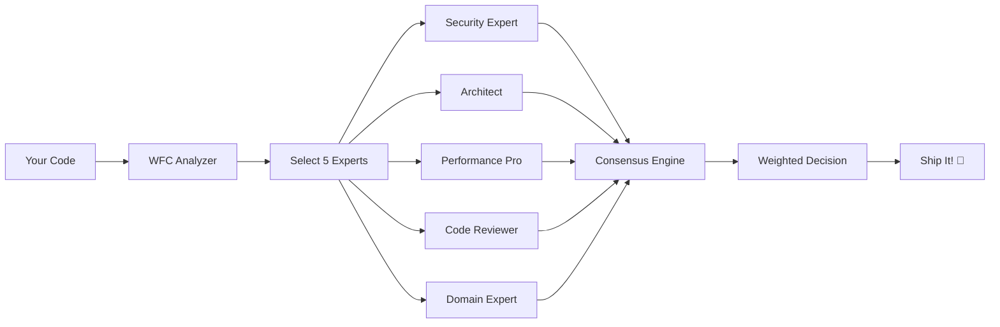
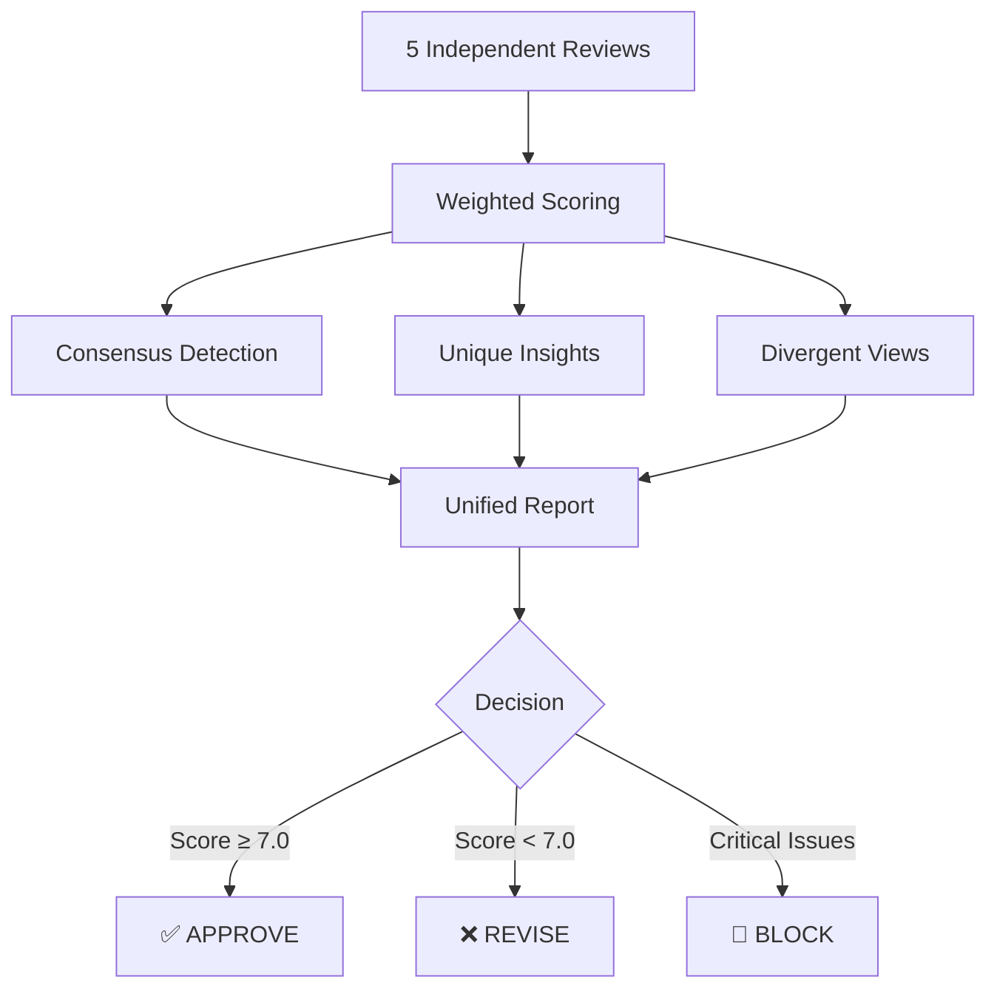

<div align="center">

```
╦ ╦╔═╗╔═╗
║║║╠╣ ║
╚╩╝╚  ╚═╝
WORLD FUCKING CLASS
```

# 🚀 The Multi-Agent Framework That Doesn't Fuck Around

[](https://opensource.org/licenses/MIT)
[](https://www.python.org/downloads/)
[](https://claude.ai/code)
[](docs/CONTRIBUTING.md)

**Stop shipping bugs. Start shipping excellence.**

WFC isn't just another code review tool—it's a **panel of 54 expert AI personas** that tear through your code like a senior engineering review board, but in **parallel**, without **ego**, and with **zero** coffee breaks.

[Quick Start](#-quick-start) • [Features](#-the-wfc-difference) • [Docs](docs/) • [Examples](docs/examples/) • [Contributing](docs/CONTRIBUTING.md)

</div>

---

## 💥 The Problem

You push code. Claude reviews it. One perspective. One opinion. One chance to miss that **critical security flaw**, that **performance bottleneck**, that **architectural landmine**.

**What if you had an entire engineering team review your code—every single commit?**

## ✨ The WFC Solution

WFC assembles a **dream team of specialists** for every code review:
- 🛡️ Security experts who've seen every attack vector
- 🏗️ Architects who spot design flaws instantly
- ⚡ Performance engineers who catch N+1s before production
- 🔬 Quality specialists who demand excellence

**All reviewing your code. In parallel. Right now.**

## 🎯 The WFC Difference

<table>
<tr>
<td width="50%">

### 😴 Traditional Code Review
- Single reviewer, single perspective
- Sequential reviews = slow feedback
- Anchoring bias in team reviews
- Miss edge cases & security holes
- Reviewer fatigue & blind spots

</td>
<td width="50%">

### 🔥 WFC Multi-Agent Review
- **54 expert personas**, 5 per review
- **True parallel** execution
- **Zero bias**—independent opinions
- **Multi-domain** coverage guaranteed
- **Never tired**, always thorough

</td>
</tr>
</table>

### ⚡ How It Works



**Intelligence baked in:**
- 🧠 **Smart Persona Selection**: Matches your tech stack, complexity, and risk profile
- 🎯 **Relevance Weighting**: Security experts weigh more on auth code
- 🔬 **Consensus Detection**: Flags issues 3+ experts agree on
- 💎 **Unique Insights**: Surfaces criticals only ONE expert caught

## 🚀 60 Second Setup

**Get elite code review in less time than it takes to make coffee:**

```bash
git clone https://github.com/sam-fakhreddine/wfc.git
cd wfc
pip install -e ".[all]"
```

**That's it.** WFC is now installed and ready to tear through your codebase.

The installer automatically:
- ✅ Installs WFC to `~/.claude/skills/wfc`
- ✅ Loads 54 expert personas
- ✅ Configures intelligent selection algorithm
- ✅ Integrates with Claude Code

---

## 🎬 Your First Review

**In Claude Code:**

```bash
/wfc:consensus-review TASK-001
```

**Watch WFC work:**

```
🔍 Analyzing codebase...
   └─ Tech Stack: Python, FastAPI, PostgreSQL, Redis
   └─ Complexity: L (Large)
   └─ Properties: SECURITY, PERFORMANCE

🎯 Selecting expert panel...
   ✓ APPSEC_SPECIALIST (0.95 relevance) - OAuth/JWT expert
   ✓ BACKEND_PYTHON_SENIOR (0.88) - FastAPI patterns
   ✓ API_SECURITY_SPECIALIST (0.82) - Token security
   ✓ DB_ARCHITECT_SQL (0.72) - Token storage
   ✓ SRE_SPECIALIST (0.61) - Key rotation, monitoring

🔬 Running parallel reviews...
   ████████████████████ 100% (5/5 experts)

📊 Synthesizing consensus...
   Overall Score: 8.0/10 (weighted)

✅ APPROVED with recommendations
```

**Want specific experts?** Override the AI:

```bash
/wfc:consensus-review TASK-001 --personas BACKEND_PYTHON_SENIOR,APPSEC_SPECIALIST,DB_ARCHITECT_SQL
```

---

## 🏗️ WFC:IMPLEMENT - The Implementation Beast

<div align="center">

### ✅ PRODUCTION READY ✅
**Phases 1-3: 100% Complete**

**5 agents. 5 parallel worktrees. 1 unbreakable main branch.**

</div>

### 💪 What It Does

WFC:IMPLEMENT doesn't just implement features—it **orchestrates a team of AI agents** working in **parallel**, following **strict TDD**, with **automatic quality gates** and **zero-downtime merges**.

<table>
<tr>
<td width="33%">

#### 🔄 TDD Enforcement
**6-phase workflow:**
1. 🧠 UNDERSTAND
2. 🔴 TEST_FIRST (RED)
3. 🟢 IMPLEMENT (GREEN)
4. ♻️ REFACTOR
5. ✅ QUALITY_CHECK
6. 📦 SUBMIT

</td>
<td width="33%">

#### 🧠 Intelligence
- **Confidence-first**: Agents assess capability before acting
- **Cross-session memory**: Learns from past mistakes
- **Token optimization**: 99% reduction with smart budgets
- **Failure classification**: WARNING vs ERROR vs CRITICAL

</td>
<td width="33%">

#### 🛡️ Safety
- **Universal quality gate**: Trunk.io (100+ tools)
- **Automatic rollback**: Main always passing
- **Isolated worktrees**: Parallel work, zero conflicts
- **Integration testing**: Every merge validated

</td>
</tr>
</table>

### ⚡ Quick Start

```bash
# 1. Create intelligent plan
wfc plan
   └─ Generates TASKS.md, PROPERTIES.md, TEST-PLAN.md

# 2. Execute with parallel agents
wfc implement --tasks plan/TASKS.md
   └─ Spawns up to 5 agents in isolated worktrees
   └─ Each follows strict TDD workflow
   └─ Auto-merges on success, rollback on failure

# 3. Verify system health
make doctor
   └─ 13 health checks across 7 categories
```

### 📊 By The Numbers

| Metric | Value |
|--------|-------|
| **Token Reduction** | 99% (58K → 3K) |
| **Parallel Agents** | Up to 5 simultaneous |
| **Quality Tools** | 100+ via Trunk.io |
| **Test Coverage** | >80% (22 integration tests) |
| **Confidence Threshold** | ≥90% to proceed |
| **Success Rate** | Tracked cross-session |

### 🎯 Features Overview

<details>
<summary><b>Phase 1: Core Foundation</b> ✅</summary>

- ✅ **Universal Quality Gate** - Trunk.io integration (all languages)
- ✅ **Complete TDD Workflow** - 6 phases enforced
- ✅ **Merge Engine with Rollback** - Main branch always passing
- ✅ **CLI Interface** - User-friendly with dry-run mode

</details>

<details>
<summary><b>Phase 2: Intelligence Layer</b> ✅</summary>

- ✅ **Confidence Checking** - SuperClaude pattern (≥90% proceed, 70-89% ask, <70% stop)
- ✅ **Memory System** - ReflexionMemory for cross-session learning
- ✅ **Token Budgets** - Complexity-based with historical optimization
  - S: 200 tokens | M: 1K | L: 2.5K | XL: 5K

</details>

<details>
<summary><b>Phase 3: Production Polish</b> ✅</summary>

- ✅ **PROJECT_INDEX.json** - Machine-readable project structure
- ✅ **make doctor** - Comprehensive health diagnostics
- ✅ **Integration Tests** - >80% coverage (22 comprehensive tests)
- ✅ **Complete Documentation** - Full implementation guide

</details>

**📚 Learn More:**
- [Complete Guide](docs/WFC_IMPLEMENTATION.md) - Full documentation
- [Implementation Patterns](PLANNING.md#implementation-patterns) - TDD, confidence-first, cross-session learning
- [Usage Examples](CLAUDE.md#wfcimplement---multi-agent-parallel-implementation) - Quick reference

---

## 🎭 Meet Your 54-Expert Review Board

<div align="center">

**The most specialized AI code review team ever assembled**

| Panel | Experts | Specialty |
|-------|---------|-----------|
| 👨‍💻 **Engineering** | 11 | Python • Node • Java • Go • Rust • React • Vue • Angular • iOS • Android |
| 🛡️ **Security** | 8 | AppSec • PenTest • Compliance • Cloud Security • API Security • Crypto |
| 🏗️ **Architecture** | 7 | Solutions • APIs • Microservices • DDD • Event-Driven • Cloud • Integration |
| ✅ **Quality** | 8 | Performance • Load Testing • Code Review • Test Automation • Chaos • A11y |
| 📊 **Data** | 4 | SQL • NoSQL • Data Engineering • ML Engineering |
| 🎨 **Product** | 3 | Developer Experience • Technical PM • UX Research |
| ⚙️ **Operations** | 4 | SRE • Platform • DevOps • Observability |
| 🏦 **Domain** | 5 | Fintech • Healthcare (HIPAA) • E-commerce • Gaming • IoT |
| 🔧 **Specialists** | 4 | WCAG • Performance Optimization • i18n • Tech Debt |

**Total: 54 experts ready to review your code**

</div>

### 🎯 Intelligent Selection Algorithm

WFC doesn't just randomly pick experts—it **analyzes your code** and **selects the perfect panel**:

```python
def select_review_panel(task):
    score = (
        0.40 * tech_stack_match(task.files)      # Python + FastAPI → Python expert
      + 0.30 * property_alignment(task.props)    # SECURITY → Security experts
      + 0.15 * complexity_filter(task.size)      # XL tasks → Senior personas
      + 0.10 * task_type_match(task.type)        # API design → API expert
      + 0.05 * domain_knowledge(task.domain)     # Payments → Fintech expert
    )

    # Enforce diversity: max 2 per panel
    return top_5_diverse(scores)
```

**The result?** Every review panel is **custom-tailored** to your exact code.

## 🔬 Selection In Action

**Real example: OAuth2 + JWT implementation**

```yaml
📋 Task Analysis:
   Type: Feature Implementation (OAuth2 login with JWT)
   Files: auth_service.py, jwt_handler.py
   Tech Stack: Python, FastAPI, PostgreSQL, Redis
   Complexity: L (Large)
   Properties: SECURITY, SAFETY

🎯 Scoring Matrix:
                           Tech  Props  Complexity  Type  Domain  TOTAL
   APPSEC_SPECIALIST       0.38  0.30      0.12    0.10   0.05 = 0.95 ⭐
   BACKEND_PYTHON_SENIOR   0.40  0.18      0.15    0.10   0.05 = 0.88 ⭐
   API_SECURITY_SPECIALIST 0.30  0.30      0.12    0.10   0.00 = 0.82 ⭐
   DB_ARCHITECT_SQL        0.35  0.10      0.12    0.08   0.07 = 0.72 ⭐
   SRE_SPECIALIST          0.20  0.15      0.12    0.05   0.09 = 0.61 ⭐
   FRONTEND_REACT_EXPERT   0.05  0.00      0.05    0.00   0.00 = 0.10 ❌
   ML_ENGINEER             0.10  0.00      0.08    0.00   0.00 = 0.18 ❌

✅ Selected Panel:
   1. 🛡️ APPSEC_SPECIALIST (0.95) - OAuth/JWT security patterns
   2. 🐍 BACKEND_PYTHON_SENIOR (0.88) - FastAPI best practices
   3. 🔐 API_SECURITY_SPECIALIST (0.82) - Token security & rotation
   4. 🗄️ DB_ARCHITECT_SQL (0.72) - Secure token storage
   5. 🚨 SRE_SPECIALIST (0.61) - Monitoring & key rotation

🎭 Panel Diversity: ✅
   Security Panel: 2/8 experts
   Engineering Panel: 1/11 experts
   Data Panel: 1/4 experts
   Operations Panel: 1/4 experts
   (Max 2 per panel enforced)
```

## 🔬 Zero Bias, True Parallelism

<div align="center">

### The Secret Sauce: Independent Subagents

**Each expert reviews in complete isolation—zero context sharing**

</div>

```python
# The WFC Way: True independence
reviews = parallel_map(
    lambda persona: execute_review_in_isolation(persona),
    selected_personas  # Each runs in separate subprocess
)

# THEN and ONLY THEN: Synthesis
consensus = synthesize_reviews(reviews, relevance_scores)
```

<table>
<tr>
<td width="50%">

### ❌ Traditional Multi-Agent
```
Agent 1: "I think this is good"
Agent 2: *reads Agent 1's review*
        "Yeah, I agree..."
Agent 3: *anchoring bias intensifies*
        "Me too!"
```
**Result**: Groupthink, missed issues

</td>
<td width="50%">

### ✅ WFC Multi-Agent
```
Agent 1 (isolated): "Security: 8/10"
Agent 2 (isolated): "Security: 4/10"
Agent 3 (isolated): "Security: 9/10"
```
**Result**: Disagreement surfaces
         → Deeper investigation
         → Critical bug found

</td>
</tr>
</table>

**Why this matters:**
- 🎯 **No anchoring bias** - Experts form independent opinions
- 💎 **Unique insights surface** - If only 1 expert caught it, you still see it
- ⚖️ **Disagreements preserved** - Not averaged into meaningless consensus
- 🔬 **Genuine multi-perspective** - Not just one opinion echoed 5 times

## 📈 The Consensus Engine

After all experts finish their **independent** reviews, WFC synthesizes their findings using **relevance-weighted consensus**:



### 🎯 Real Review Output

```diff
╔════════════════════════════════════════════════════════════════╗
║  WFC CONSENSUS REVIEW - TASK-001 (OAuth2 Implementation)      ║
╚════════════════════════════════════════════════════════════════╝

📊 OVERALL SCORE: 8.0/10 (relevance-weighted)

┌─────────────────────────────────────────────────────────────┐
│ ✅ CONSENSUS AREAS (4/5 experts agree)                      │
├─────────────────────────────────────────────────────────────┤
│ • Auth flow implementation is solid                         │
│ • Clean FastAPI patterns throughout                         │
│ • Good separation of concerns                               │
│ • Adequate error handling                                   │
└─────────────────────────────────────────────────────────────┘

┌─────────────────────────────────────────────────────────────┐
│ 🚨 CRITICAL ISSUES (Must Fix)                               │
├─────────────────────────────────────────────────────────────┤
│ 1. PII in JWT payload (APPSEC + API_SECURITY)              │
│    └─ Severity: CRITICAL                                    │
│    └─ Impact: GDPR violation, security risk                 │
│    └─ Fix: Remove username from token claims                │
│                                                             │
│ 2. Missing token refresh rotation (APPSEC only)            │
│    └─ Severity: HIGH                                        │
│    └─ Impact: Compromised tokens never expire               │
│    └─ Fix: Implement refresh token rotation pattern         │
└─────────────────────────────────────────────────────────────┘

┌─────────────────────────────────────────────────────────────┐
│ 💎 UNIQUE INSIGHTS (Only 1 expert caught these)             │
├─────────────────────────────────────────────────────────────┤
│ • Token table missing index on user_id (DB_ARCHITECT)      │
│   └─ Fix: ALTER TABLE tokens ADD INDEX idx_user_id         │
│                                                             │
│ • No metrics for token failures (SRE_SPECIALIST)           │
│   └─ Fix: Add token_validation_failures counter            │
└─────────────────────────────────────────────────────────────┘

┌─────────────────────────────────────────────────────────────┐
│ ⚖️ DIVERGENT VIEWS (Experts disagree - investigate!)       │
├─────────────────────────────────────────────────────────────┤
│ • Token expiration time:                                    │
│   └─ APPSEC: 15 minutes (more secure)                      │
│   └─ BACKEND: 1 hour (better UX)                           │
│   └─ Recommendation: 30 minutes + refresh pattern          │
└─────────────────────────────────────────────────────────────┘

╔════════════════════════════════════════════════════════════════╗
║  DECISION: ⚠️ CONDITIONAL APPROVE                             ║
╠════════════════════════════════════════════════════════════════╣
║  Required Changes:                                             ║
║  1. Remove PII from JWT payload                                ║
║  2. Implement refresh token rotation                           ║
║  3. Add database index on user_id                              ║
║  4. Add token failure metrics                                  ║
║                                                                ║
║  ⏱️ Re-review after changes                                    ║
╚════════════════════════════════════════════════════════════════╝
```

**The result?** Nothing slips through the cracks.

## 🔧 Extend & Customize

**Need a specialist we don't have?** Build your own expert personas:

```bash
# 1. Create custom persona
cat > ~/.claude/skills/wfc/personas/custom/MY_EXPERT.json <<EOF
{
  "id": "MY_CUSTOM_EXPERT",
  "name": "Blockchain Security Expert",
  "panel": "security",
  "skills": ["solidity", "smart_contracts", "web3"],
  "lens": {"focus": "blockchain_security", "depth": "expert"},
  "selection_criteria": {"keywords": ["web3", "solidity", "smart contract"]}
}
EOF

# 2. Rebuild registry
cd ~/.claude/skills/wfc/personas
python3 -c "from persona_orchestrator import PersonaRegistry; PersonaRegistry.rebuild_registry()"

# 3. Use it
/wfc:consensus-review --personas MY_CUSTOM_EXPERT,APPSEC_SPECIALIST
```

**Want to contribute?** See [CONTRIBUTING.md](docs/CONTRIBUTING.md) to add personas to the core library.

---

## 💡 Why WFC?

<table>
<tr>
<td width="50%">

### 😩 Without WFC
- "Ship it, looks good to me"
- Critical bug in production
- "Why didn't anyone catch this?"
- Security breach, downtime, panic
- Post-mortem: "We need better reviews"

**The cycle repeats...**

</td>
<td width="50%">

### 😎 With WFC
- 54 experts review every line
- Security, performance, architecture analyzed
- Bugs caught before commit
- Production stays stable
- Team ships with confidence

**The cycle stops.**

</td>
</tr>
</table>

**Time savings:** 5 experts review in parallel = **same time as 1 review**

**Quality gains:** 54 specialized perspectives = **issues you'd never catch alone**

**Cost:** Free, open source, runs locally

---

## 📚 Documentation

<table>
<tr>
<td>

**📖 Guides**
- [Architecture](docs/ARCHITECTURE.md)
- [Implementation Guide](docs/WFC_IMPLEMENTATION.md)
- [Contributing](docs/CONTRIBUTING.md)

</td>
<td>

**📋 Reference**
- [Complete Persona Library](docs/PERSONAS.md)
- [Configuration Options](wfc/shared/config/wfc_config.py)
- [Examples & Use Cases](docs/examples/)

</td>
</tr>
</table>

**Quick config:** `~/.claude/skills/wfc/shared/config/wfc_config.py`

```python
DEFAULTS = {
    "personas": {
        "num_reviewers": 5,           # Panel size
        "require_diversity": True,    # Enforce diverse panels
        "min_relevance_score": 0.3,   # Selection threshold
        "consensus_threshold": 3,     # Issues need 3+ agrees
        "weight_by_relevance": True   # Smart scoring
    }
}
```

---

## 🧪 Testing & Health

```bash
# Run WFC test suite
pytest -v

# System health check
make doctor

# Integration tests
make test-integration
```

---

## 🎁 The Complete Suite

WFC isn't just review—it's a **complete engineering workflow**:

| Skill | Status | What It Does |
|-------|--------|--------------|
| 🏗️ **wfc:implement** | ✅ Production | Multi-agent parallel implementation with TDD |
| 👀 **wfc:review** | ✅ Production | 54-expert consensus code review |
| 📋 **wfc:plan** | ✅ Production | Intelligent task breakdown & planning |
| 🧪 **wfc:test** | ✅ Production | Property-based test generation |
| 🛡️ **wfc:security** | ✅ Production | STRIDE threat modeling & security analysis |
| 🏛️ **wfc:architecture** | ✅ Production | C4 diagrams & architecture documentation |
| 📊 **wfc:observe** | ✅ Production | Observability from formal properties |
| 🔄 **wfc:retro** | ✅ Production | AI-powered retrospective analysis |
| 🔒 **wfc:safeclaude** | ✅ Production | Safe command allowlist generation |
| 🤔 **wfc:isthissmart** | ✅ Production | Critical thinking advisor |
| ⚡ **wfc:newskill** | ✅ Production | Meta-skill for creating new skills |

**All skills are Agent Skills compliant and production-ready.**

---

## 📜 License

MIT License - see [LICENSE](LICENSE) for details.

---

## 🙏 Acknowledgments

Built on [Claude Code](https://claude.ai/code)'s agent framework. Inspired by ensemble methods in machine learning and the wisdom of diverse expert panels.

---

<div align="center">

## 📊 Stats That Matter

| Metric | Value |
|--------|-------|
| **Expert Personas** | 54 across 9 panels |
| **Agent Skills** | 11 production-ready |
| **Token Reduction** | 99% (58K → 3K) |
| **Test Coverage** | >80% |
| **Quality Tools** | 100+ via Trunk.io |
| **Model Support** | Opus 4.6, Sonnet 4.5, Haiku 4.5 |

---

### 🚀 Current Version: 0.1.0

**Everything. Production Ready. Zero Compromises.**

---

## ⭐ Like What You See?

<table>
<tr>
<td width="33%" align="center">

### 📖 Read the Docs
[Full Documentation](docs/)

</td>
<td width="33%" align="center">

### 🤝 Contribute
[Contributing Guide](docs/CONTRIBUTING.md)

</td>
<td width="33%" align="center">

### ⭐ Star the Repo
[GitHub](https://github.com/sam-fakhreddine/wfc)

</td>
</tr>
</table>

---

<br>

**This is World Fucking Class.** 🚀

Built with 🔥 by engineers who refuse to ship bugs.

</div>
