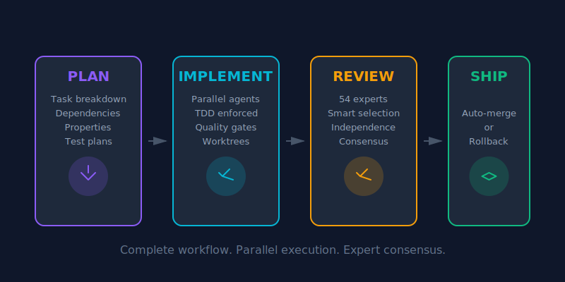

<div align="center">


# The Multi-Agent Framework That Doesn't Fuck Around

[](https://opensource.org/licenses/MIT)
[](https://www.python.org/downloads/)
[](https://agentskills.io)

**From idea to production with a team of 54 AI experts.**

WFC is a complete development workflow powered by specialized AI agents. Plan features, implement in parallel with TDD, and get multi-expert consensus reviews—all automated.

[Quick Start](#quick-start) • [Workflow](#the-wfc-workflow) • [Install](#installation) • [Docs](docs/)

</div>

---

## The Problem

Traditional development: one developer, one perspective, sequential execution.

You write code alone, review happens at the end (if at all), and critical issues slip through. Security flaws, performance bottlenecks, architectural mistakes—all discovered too late.

## The WFC Solution

**An entire engineering team for your complete workflow.**

<div align="center">

</div>

Not just review. **Planning, implementation, and review in one system.**

---

## The WFC Workflow

### 1. Planning (`/wfc:plan`)

Transform requirements into structured implementation plans:

- **Task breakdown** - Dependencies, complexity, assignments
- **Formal properties** - SAFETY, LIVENESS, PERFORMANCE requirements
- **EARS format** - Clear, testable requirements using industry standard
- **Test plans** - What to test and why

**Output:** `TASKS.md`, `PROPERTIES.md`, `TEST-PLAN.md`

**Uses [EARS](docs/EARS.md)** (Easy Approach to Requirements Syntax) for unambiguous, testable requirements developed by Rolls-Royce/Airbus for safety-critical systems.

### 2. Implementation (`/wfc:implement`)

Execute tasks with parallel TDD agents:

- **Parallel execution** - Up to 5 agents in isolated git worktrees
- **TDD enforced** - Tests first, then implementation
- **Quality gates** - Linting, formatting, tests before review
- **Auto-merge** - Pass review → merge. Fail → rollback.

**Each agent:** Understand → Test First → Implement → Refactor → Quality Check → Submit

### 3. Review (`/wfc:review`)

Multi-expert consensus code review:

- **54 specialized personas** - Security, architecture, performance, quality
- **Smart selection** - Auto-picks 5 relevant experts per review
- **True independence** - No context sharing, zero anchoring bias
- **Weighted consensus** - Security experts weigh more on auth code

**Decision:** Overall score ≥7.0 + no criticals = Ship

---

## Quick Start

### Installation

```bash
git clone https://github.com/sam-fakhreddine/wfc.git
cd wfc
./install-universal.sh
```

**Detects and installs to:** Claude Code, Kiro, OpenCode, Cursor, VS Code, Codex, Antigravity

**Branding Modes:**
- **SFW** (Safe For Work) → "Workflow Champion" - Professional language
- **NSFW** (Default) → "World Fucking Class" - No bullshit

Choose during installation. [More details](docs/BRANDING.md)

### Example: Build a Feature

```bash
# 1. Plan the feature
/wfc:plan
> "Add OAuth2 login with JWT tokens"

# Generates: TASKS.md, PROPERTIES.md, TEST-PLAN.md

# 2. Implement with parallel agents
/wfc:implement

# Spawns 5 agents, each:
# - Writes tests first (RED)
# - Implements (GREEN)
# - Refactors
# - Passes quality gates
# - Gets reviewed
# - Auto-merges or rolls back

# 3. Final verification
/wfc:review

# 54 experts available:
# - APPSEC_SPECIALIST (OAuth security)
# - BACKEND_PYTHON_SENIOR (FastAPI patterns)
# - DB_ARCHITECT_SQL (Token storage)
# - SRE_SPECIALIST (Key rotation)
# - PERF_TESTER (Response times)
```

---

## Key Features

<div align="center">

<table>
<tr>
<td align="center" width="200">

<br><strong>Parallel Execution</strong>
<br><sub>Up to 5 agents working concurrently in isolated worktrees</sub>
</td>
<td align="center" width="200">

<br><strong>Smart Selection</strong>
<br><sub>Auto-picks 5 relevant experts from 54 specialized personas</sub>
</td>
<td align="center" width="200">

<br><strong>92% Token Reduction</strong>
<br><sub>Progressive disclosure loads only what you need</sub>
</td>
<td align="center" width="200">

<br><strong>8+ Platforms</strong>
<br><sub>Works with Claude Code, Kiro, and all Agent Skills platforms</sub>
</td>
</tr>
</table>

</div>

---

## Platform Compatibility

**Works with 8+ Agent Skills platforms:**

- Claude Code
- Kiro (AWS)
- OpenCode
- Cursor
- VS Code
- OpenAI Codex
- Google Antigravity
- Goose

**Install once, use everywhere.** Symlinks keep them synchronized.

---

## The 54 Expert Personas

| Panel | Count | Examples |
|-------|-------|----------|
| **Engineering** | 11 | Python, Node, Go, Rust, React, iOS, Android |
| **Security** | 8 | AppSec, PenTest, Cloud Security, Compliance |
| **Architecture** | 7 | Solutions, APIs, Microservices, Event-Driven |
| **Quality** | 8 | Performance, Load Testing, Code Review, A11y |
| **Data** | 4 | SQL, NoSQL, Data Engineering, ML |
| **Product** | 3 | Developer Experience, Technical PM |
| **Operations** | 4 | SRE, Platform, DevOps, Observability |
| **Domain** | 5 | Fintech, Healthcare, E-commerce, Gaming |
| **Specialists** | 4 | WCAG, Performance Optimization, i18n |

**Total: 54 experts ready to work**

[Complete Persona Library](docs/PERSONAS.md)

---

## How Smart Selection Works

WFC analyzes your code and picks the right experts:

**Example: OAuth2 + JWT Implementation**

```
Analyzing:
- Tech stack: Python, FastAPI, PostgreSQL, Redis
- Files: auth_service.py, jwt_handler.py
- Properties: SECURITY, SAFETY
- Complexity: Large

Selected Panel:
1. APPSEC_SPECIALIST (0.95) - OAuth/JWT security
2. BACKEND_PYTHON_SENIOR (0.88) - FastAPI best practices
3. API_SECURITY_SPECIALIST (0.82) - Token security
4. DB_ARCHITECT_SQL (0.72) - Secure token storage
5. SRE_SPECIALIST (0.61) - Monitoring & rotation

Decision: CONDITIONAL APPROVE
Required: Fix PII in JWT, add token rotation
```

---

## Progressive Disclosure

**92% token reduction** with on-demand loading:

- **Traditional:** Load all 54 personas (~43K tokens)
- **WFC:** Load summaries (~3.4K tokens), fetch details when needed
- **Result:** 10x faster, same capability

Works in all Agent Skills platforms.

---

## Complete Skill Suite

| Skill | Purpose |
|-------|---------|
| `wfc:plan` | Structured task breakdown & planning |
| `wfc:implement` | Parallel TDD implementation |
| `wfc:review` | Multi-expert consensus review |
| `wfc:test` | Property-based test generation |
| `wfc:security` | STRIDE threat modeling |
| `wfc:architecture` | C4 diagrams & architecture docs |
| `wfc:observe` | Observability from properties |
| `wfc:retro` | AI-powered retrospectives |
| `wfc:safeclaude` | Safe command allowlist |
| `wfc:isthissmart` | Critical thinking advisor |
| `wfc:newskill` | Create new WFC skills |

---

## Example Workflows

### New Feature

```
1. /wfc:isthissmart "Add OAuth2 login"
   → Validates approach

2. /wfc:plan
   → Generates TASKS.md

3. /wfc:implement
   → Parallel TDD execution

4. /wfc:review
   → Final consensus review
```

### Security Audit

```
1. /wfc:security --stride
   → Threat model

2. /wfc:review --properties SECURITY,SAFETY
   → Security-focused review
```

### Bug Fix

```
1. /wfc:review affected-file.py
   → Expert analysis

2. Fix → /wfc:review
   → Verify fix
```

---

## Documentation

**Getting Started**
- [Quick Start Guide](QUICKSTART.md)
- [Installation](docs/UNIVERSAL_INSTALL.md)
- [Examples](docs/examples/)

**Reference**
- [Architecture](docs/ARCHITECTURE.md)
- [Persona Library](docs/PERSONAS.md)
- [Configuration](wfc/shared/config/wfc_config.py)

**Contributing**
- [Contributing Guide](docs/CONTRIBUTING.md)
- [Creating Skills](docs/CREATING_SKILLS.md)

---

## Performance

| Metric | Value |
|--------|-------|
| **Expert Personas** | 54 |
| **Parallel Agents** | Up to 5 |
| **Token Reduction** | 92% (progressive disclosure) |
| **Quality Tools** | 100+ via Trunk.io |
| **Supported Platforms** | 8+ (Agent Skills standard) |

---

## Acknowledgments

Built on [Claude Code](https://claude.ai/code)'s agent framework. Inspired by ensemble methods in machine learning and the wisdom of diverse expert panels.

Special thanks to [SuperClaude](https://github.com/SuperClaude-Org/SuperClaude_Framework) for pioneering multi-agent patterns and demonstrating the power of specialized personas working in concert. Their confidence-first approach and agent orchestration patterns heavily influenced WFC's architecture.

---

## License

MIT License - see [LICENSE](LICENSE)

---

<div align="center">

**This is World Fucking Class.**

*Complete workflow. Parallel execution. Expert consensus.*

[Get Started](QUICKSTART.md) • [Star on GitHub](https://github.com/sam-fakhreddine/wfc)

</div>
