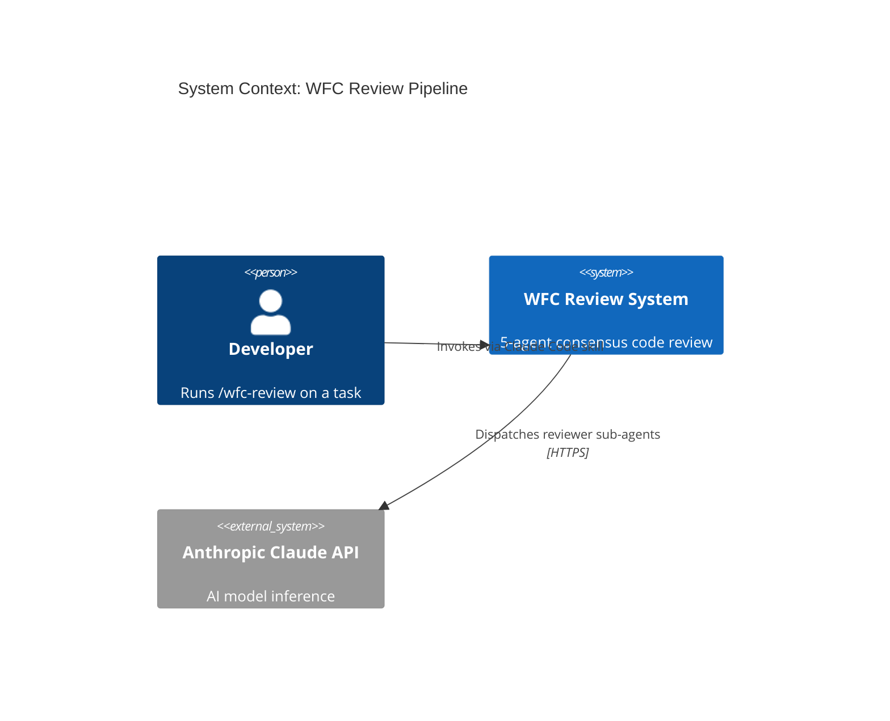
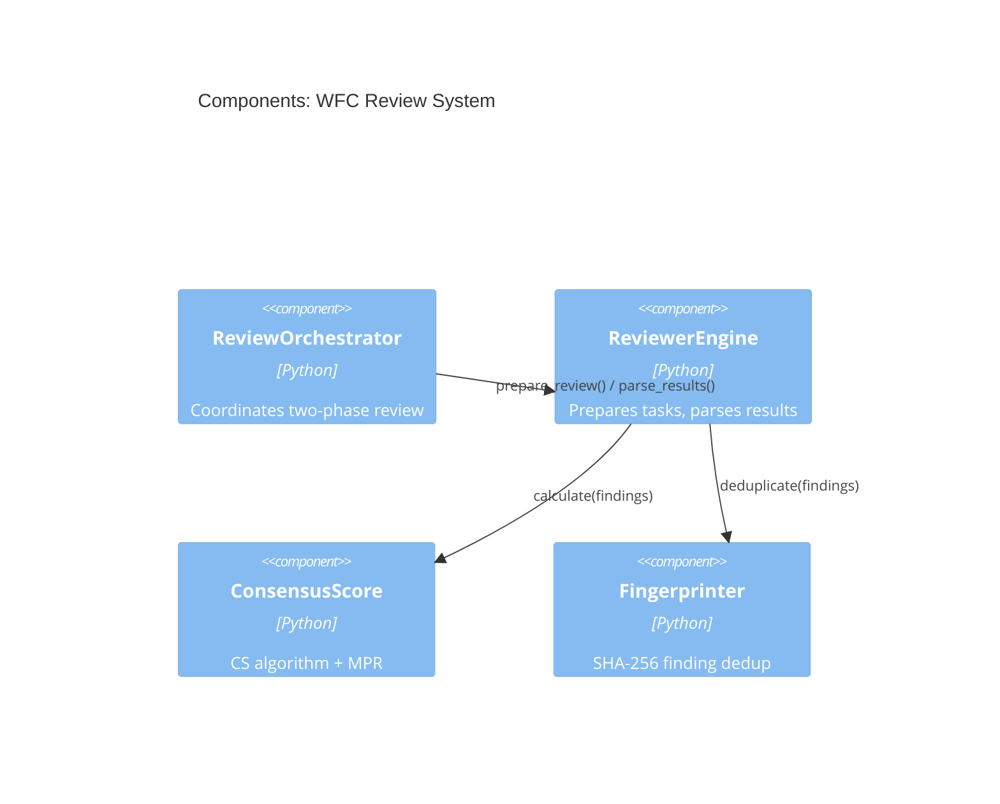

# wfc-architecture

## What It Does

Generates comprehensive architecture documentation from your plan and codebase, including C4 diagrams at three levels of abstraction (Context, Container, Component) rendered in Mermaid format. It also produces Architecture Decision Records (ADRs) for significant choices and can audit your codebase to verify that actual code structure matches the documented architecture. The primary output is `ARCHITECTURE.md`.

## When to Use It

- Starting a new project or service and need to document the intended structure
- Onboarding new team members who need a visual map of the system
- After a significant refactor, to bring architecture docs back in sync with code
- When preparing for an architecture review or technical design presentation
- When you want to formally record a significant technical decision as an ADR

## Usage

```bash
/wfc-architecture [options]
```

## Example

```bash
/wfc-architecture --generate
```

C4 Context diagram excerpt (`C4-CONTEXT.mmd`):



C4 Component diagram excerpt (`C4-COMPONENT.mmd`):



ADR excerpt (`ADR-001.md`):

```markdown
# ADR-001: Five Fixed Specialist Reviewers

## Status: Accepted

## Context
Previous system used dynamic persona selection from 56 options, creating
unpredictable review quality and high token overhead.

## Decision
Replace dynamic selection with 5 fixed specialists: Security, Correctness,
Performance, Maintainability, Reliability.

## Consequences
- Positive: Predictable coverage, 99% token reduction, consistent scoring
- Negative: Cannot add domain-specific reviewers without a code change
```

## Options

| Flag | Description |
|------|-------------|
| (none) | Generate full architecture documentation (same as `--generate`) |
| `--generate` | Generate ARCHITECTURE.md, C4 diagrams, and ADRs from plan and code |
| `--audit` | Compare existing architecture docs against actual codebase structure |
| `--c4 context` | Generate only the Context-level C4 diagram |
| `--c4 container` | Generate only the Container-level C4 diagram |
| `--c4 component` | Generate only the Component-level C4 diagram |

## Integration

**Produces:**

- `ARCHITECTURE.md` — Full narrative architecture documentation
- `C4-CONTEXT.mmd` — System context diagram (Mermaid)
- `C4-CONTAINER.mmd` — Container/service diagram (Mermaid)
- `C4-COMPONENT.mmd` — Internal component diagram (Mermaid)
- `ADR-XXX.md` — Architecture Decision Records for key choices

**Consumes:**

- Existing codebase (reads structure, imports, and module boundaries)
- `TASKS.md` or `PROPERTIES.md` from `/wfc-plan` (for planned architecture)

**Next step:** Use `/wfc-validate` to evaluate the architectural approach before implementation, or `/wfc-security` to perform STRIDE threat modeling against the generated architecture.
